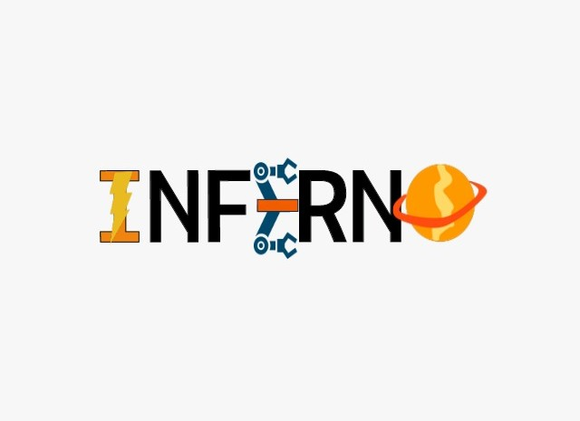
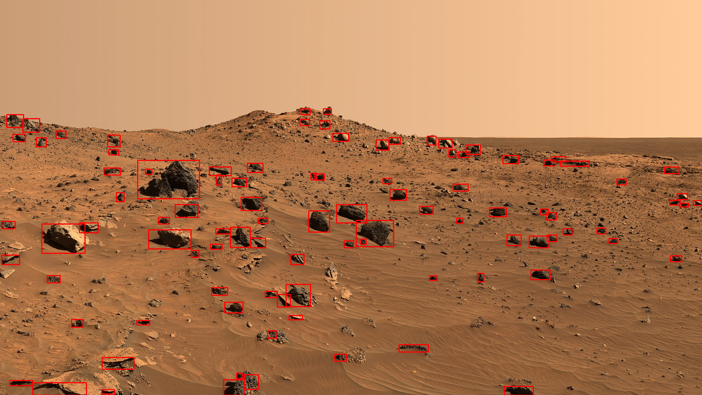
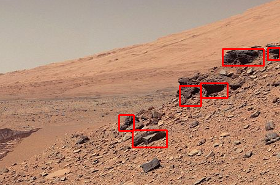

# This is an Official Repository of Inferno DTU  
Team built mars protoype rover (2018, August - 2019, January)

## Team secured 3rd rank in system review acceptance

Competed in Indian Rover Challange and secured 7th rank among 32 teams from 5 countries.

## Team secured 7th rank in Overall competition

## Project involved:
- Drive system
- Communication System
- Navigation
- Obstacle detection
- Autonomous navigation
- Science Task
- Robotic arm (forward and inverse kinematics)

## Software and Hardware used:
- ROS(Robot operating System)
- Python
- C++
- C
- Arduino
- Raspberry Pi
- OpenCV

# Demo of rock detection:

